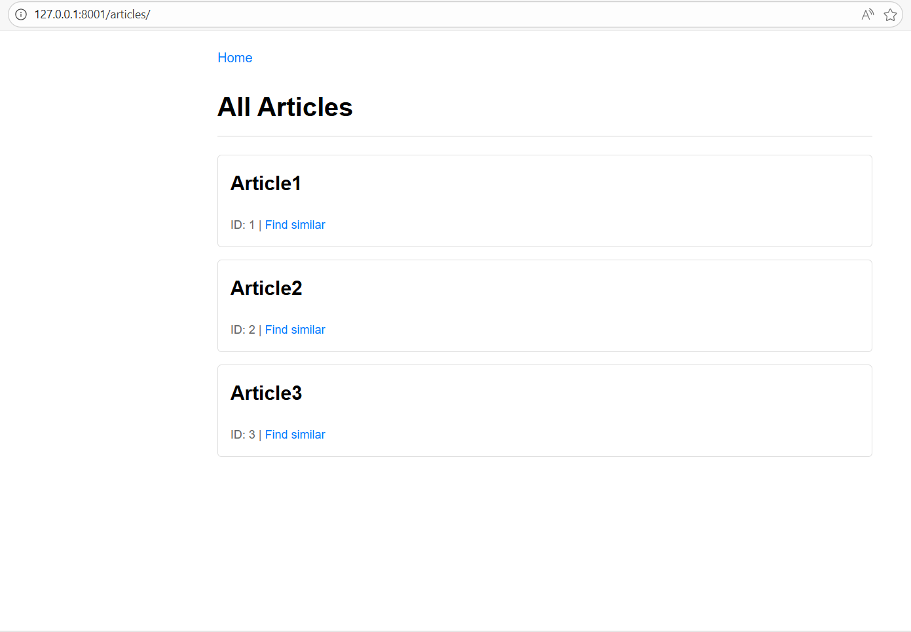
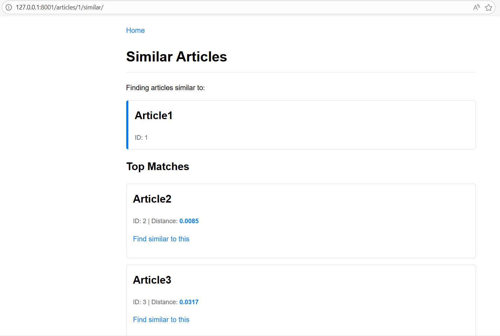
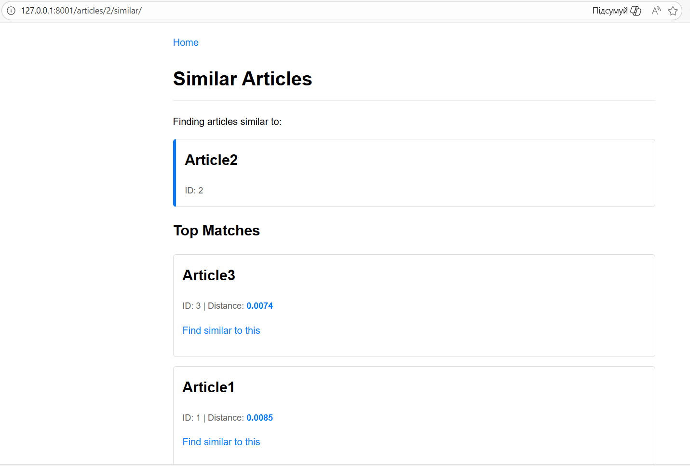
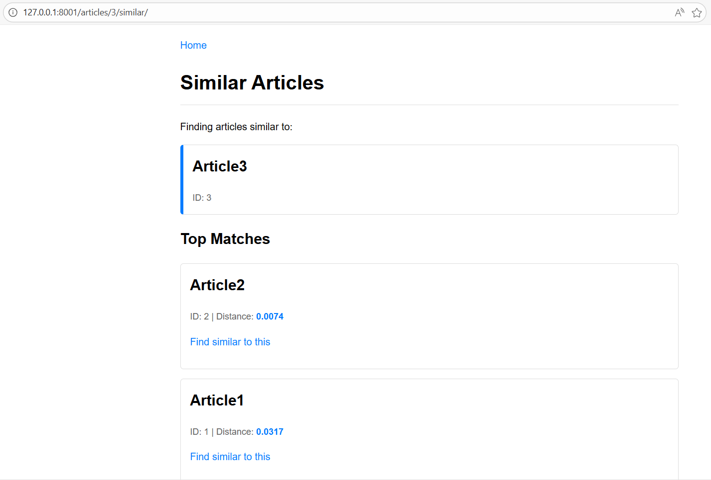
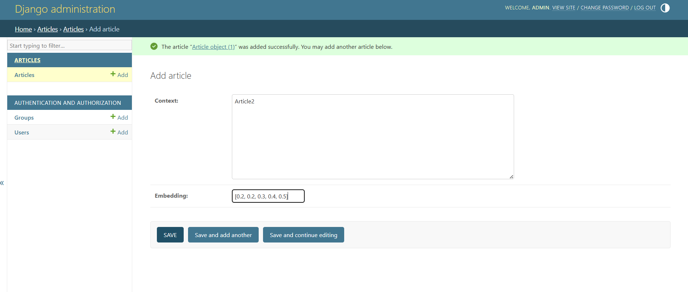

# Django MariaDB Vector Demo

## How Recommendations Work (High Level)

1. Articles are stored in the database with text content.
2. The content is embedded into a vector representation (e.g., via an embedding model).
3. To find similar articles, the app computes a distance (or similarity score) between vectors.
4. The closest vectors are returned as "similar articles."

The result is a simple recommendation system suitable for blogs, documentation, or news-style content.

---

## Examples

## Recommendations of Articles

_List of all articles_

_List of articles similar to Article with pk=1_

_List of articles similar to Article with pk=2_

_List of articles similar to Article with pk=3_

### Admin. Add the article

_Adding new article data through the Django admin_

---

## [Installation and usage](../README.md)